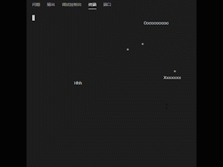

## 欢迎来玩我的贪吃蛇Online

你需要一台安装了linux的电脑，按照以下提示操作：


## 运行方法：

### 服务器端：

- 获取本机可用ip地址：

  ```shell
  ifconfig | grep -C 1 eno | grep inet | awk '{print $2}'	
  ```

- 下载服务器端文件：./server/server.out：

- 添加运行权限：

  ```shell
  chmod u+x server.out
  ```

- 运行：

  ```shell
  ./server.out [这里填写ip地址] [(可以不填)这里填写你想占用的端口号，默认10312] &
  ```

### 客户机端：

- 安装运行所需库（需要输入密码）：

  ```shell
  sudo apt-get install libncurses5
  ```

- 下载客户端文件：./client/client.out：

- 添加运行权限：

  ```shell
  chmod u+x client.out
  ```

- 运行（需要与服务器位于同一网段）：

  ```shell
  ./client.out [这里填写服务器的ip地址] [(可以不填)这里填写服务器的端口号，默认10312]
  ```


## 游戏画面预览：




## 对开发者：

项目分为服务器端与客户机端，服务器负责执行游戏逻辑并与客户机交互，客户机与用户与服务器交互。架构如下：


server建立侦听，处理新连接并交给子进程处理用户请求，利用Unix Socket传递文件定义符及控制信息。子进程利用poll监听多路文件定义符并分配工作逻辑进行处理。工作逻辑处理完成后与客户机通过TCP信道传输序列化的游戏帧及控制信息，与Reactor通过管道传递游戏状态信息。

client等待用户指令后与建立与客户端的联系并等待游戏开始信号，监听用户与服务器端文件定义符并根据情况发送或接收数据。游戏结束后重新初始化并等待用户指令。


### 编译：

编译依赖库：libncurses5，protobuf，其中curses库需要动态链接（protobuf默认静态链接）。

编译时，在主目录下调用：

```makefile
make server/server.out; make client/client.out
```


### 文件结构

- common目录中定义了便于重用的socket自定义库文件：socketLib.cpp、公有游戏组件文件：commonUtils.cpp。

- protoFile目录中定义了使用的protobuf协议格式文件：protoMsg.proto。


- server目录中定义了服务器端父进程文件：server.cpp，子进程文件：gameProcess.cpp，工作逻辑文件：gameControl.cpp，服务器端所需游戏组件文件：serverUtils.cpp。在其classFile目录中定义了描述蛇体的类Snake，以及蛇体像素类Dot。


- client目录中定义了客户机逻辑文件：client.cpp，满足自定义序列化数据传输协议的收发组件文件：msgLib.cpp，屏幕渲染组件文件：cursesLib.cpp，客户机所需游戏组件文件：clientUtils.cpp。


### Todo：

- [ ] 增加未连接成功控制
- [ ] 增加进程池机制
- [ ] 增加C-S协商确定游戏配置机制
- [ ] 优化client代码提高代码可复用性
- [ ] 尝试Proactor模式
- [ ] 增加心跳包
- [ ] 拷贝构造改用移动构造函数


